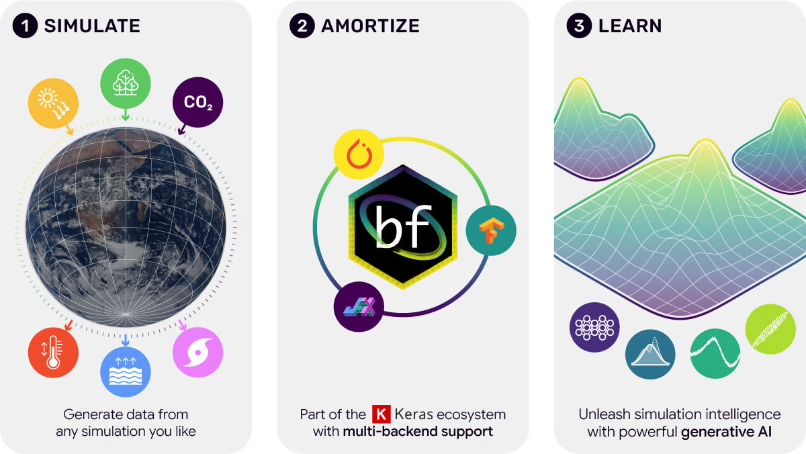
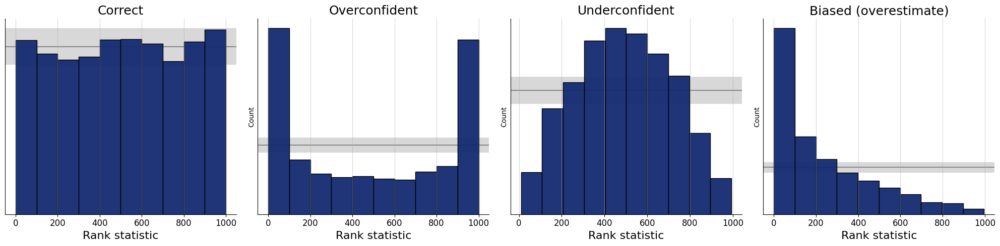
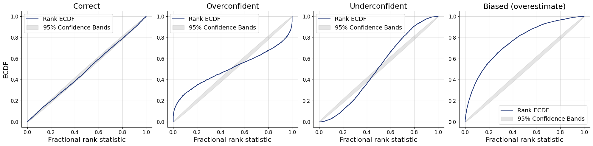
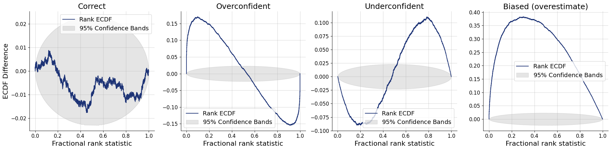
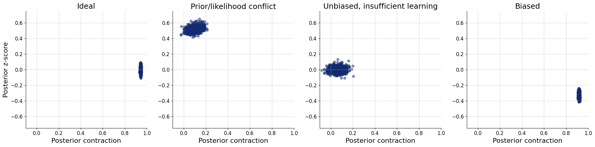
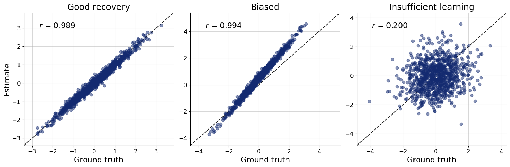
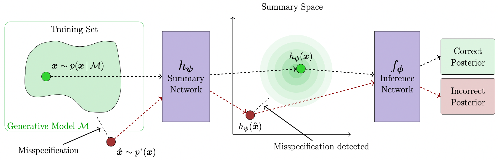

## Recap

#### Problem

We want to approximate $p(\theta \mid x)$ or $p(x \mid \theta)$

$$
p(\theta \mid x) = \frac{p(\theta) \times p(x \mid \theta)}{p(x)}
$$

- Evaluating $p(\theta)$, $p(x \mid \theta)$ and $p(x)$ may not be tractable
- But we are able to sample $(x^{(s)}, \theta^{(s)}) \sim p(x, \theta)$

#### Solution

Use generative neural networks

## Inference network

- A generative neural network $q_\phi(\theta \mid x)$
  - Normalizing flow, ... (more to come tomorrow)
  - Model the distribution of *parameters*, conditioned on data

Goal: 

$$p(\theta \mid x) \approx q_\phi(\theta \mid x)$$

## Role of "data"

- $x$ conditions the generative network
  - Normalizing flows: Input to a coupling network (usually MLP)
  - Other architectures: Input to a vector field network (usually MLP)

$\rightarrow$ Must be of fixed dimensions

## Data of varying dimensions

- Sample sizes, study design, resolution, ...

$\rightarrow$ Summary statistics

  1. Handcrafted: Mean, SD, Correlation,...
  2. Summary networks 

## Summary network $h_\psi$

- Takes input of variable size
- Outputs fixed size embedding

</br>

$\rightarrow$ Condition the inference network on the output of the summary network

$$p(\theta \mid x) \approx q_\phi(\theta \mid h_\psi(x))$$

## Learning the posterior

$$
\begin{aligned}
\hat{\phi}, \hat{\psi} = \operatorname*{argmin}_{\phi, \psi} & \mathbb{E}_{x \sim p(x)} \left[ \mathbb{KL}\big[p(\theta \mid x) \; || \; q_\phi(\theta \mid h_\psi(x))\big] \right] \\
= \operatorname*{argmin}_{\phi, \psi} & \mathbb{E}_{x \sim p(x)} \left[ \mathbb{E}_{\theta \sim p(\theta \mid x)} \left[ \log \frac{p(\theta \mid x)}{q_\phi(\theta \mid h_\psi(x))} \right] \right]  \\
\propto \operatorname*{argmin}_{\phi, \psi} & - \mathbb{E}_{(x, \theta) \sim p(x, \theta)} \left[ \log q_\phi(\theta \mid h_\psi(x)) \right] \\
\approx \operatorname*{argmin}_{\phi, \psi} & - \frac{1}{S}\sum_{s=1}^S \log q_\phi(\theta^{(s)} \mid h_\psi(x^{(s)}))
\end{aligned}
$$

$\rightarrow$ must be able to generate samples $(x^{(s)}, \theta^{(s)}) \sim p(x, \theta)$


## Training the networks 

1. Define a generative statistical model 
    - $p(x, \theta)$, typically $p(\theta) \times p(x \mid \theta)$
2. Define inference and (optional) summary networks
    - $q_\phi(x \mid h_\psi(x))$
3. Train the networks
   1. Sample from $(x^{(s)}, \theta^{(s)}) \sim p(x, \theta)$
   2. Optimize weights $\phi$ and $\psi$ so that $p(\theta \mid x) \approx q_\phi(\theta \mid h_\psi(x))$

## Inference

- Once the networks are trained, they can be used for inference
- Most of computational resources are used during training
- Inference is fast (only requires a simple pass through the network)

$\rightarrow$ Amortized inference: Pay upfront the cost of inference during training, making subsequent inference effective

## Non-Amortized Bayesian Inference

</br>
{width=100%}

## Amortized Bayesian Inference

</br>
{width=100%}

# Working with `bayesflow`

## BayesFlow 2.0 [@kuhmichelBayesFlow2026]

- Python library built on `keras3`
  - `TensorFlow`, `JAX`, or `PyTorch` as a backend
- Implementation of common neural architectures to make ABI easier
- Helper functions for simulation, configuration, training, validation, diagnostics, ...
- Website: [bayesflow.org](https://bayesflow.org/)
- Github: [github.com/bayesflow-org/bayesflow](https://github.com/bayesflow-org/bayesflow/)
- Forums: [discuss.bayesflow.org](https://discuss.bayesflow.org/)
- Install release version: `pip install bayesflow`
- Install dev version: `pip install git+https://github.com/bayesflow-org/bayesflow@dev`

## General workflow




## Ingredients

- Simulator
  - Simulate data from the statistical model 
- Adapter
  - Configure the data
- Summary network (optional)
  - Get summary embeddings
- Inference network
  - Approximate the posterior

## Quality of life

- Diagnostics
  - Plots and statistics to evaluate the approximation 
- Approximator
  - Hold ingredients necessary for approximation together
  - Adapter, Summary network, Inference network
- Workflow
  - Hold ingredients for the entire pipeline together
  - Simulator, Adapter, Summary network Inference network, Diagnostics   

## General pipeline

1. Define the statistical model (through simulator)
2. Define the approximator (through neural networks)
3. Train the neural networks
4. Validate the approximator
5. Inference and diagnostics

# 1. Define the statistical model

## Define the simulator

- Define the "statistical" model in terms of a simulator
- `bayesflow` expects "batched" simulations

```{.python filename="Python"}
class Simulator(bf.simulators.Simulator):
    def sample(self, batch_size):
        theta = np.random.beta(1, 1, size=batch_size)
        x = np.random.binomial(n=10, p=theta)
        return dict(theta=theta, x=x)

simulator = Simulator()
dataset = simulator.sample(100)
```


## Define the simulator

- Define the "statistical" model in terms of a simulator
- `bayesflow` expects "batched" simulations
- `make_simulator`: Convenient interface for "auto batching"

```{.python filename="Python"}
def prior():
    return dict(mu = np.random.normal(0, 1))

def likelihood(mu):
    return dict(x = np.random.normal(mu, 1, size=20))

simulator = bf.make_simulator([prior, likelihood])

simulator.sample(10)
```

## Simulator: Data of varying size

- The shape of data must be the same within each batch

Strategies:

1. Pad vectors to be the same length
2. Vary data shapes between batches

## Pad/mask vectors

```{.python filename="Python"}
def context():
    return dict(n = np.random.randint(10, 101))

def prior():
    return dict(mu = np.random.normal(0, 1))

def likelihood(mu, n):
    observed = np.zeros(0)
    observed[:n] = 1

    x = np.zeros(100)
    x[:n] = np.random.normal(mu, 1, size=n)
    return dict(observed=observed, x=x)

simulator = bf.make_simulator([context, prior, likelihood])

simulator.sample(10)
```

## Vary data shape between batches

```{.python filename="Python"}
def context(batch_size):
    return dict(n = np.random.randint(10, 101))

def prior():
    return dict(mu = np.random.normal(0, 1))

def likelihood(mu, n):
    x = np.random.normal(mu, 1, size=n)
    return dict(x=x)

simulator = bf.make_simulator(
  [prior, likelihood], meta_fn=context
)

simulator.sample(10)
```

## Padding vs batched context

- Both approaches work
- Batched context (via `meta_fn`) is a bit cleaner 
  - Do not have to fiddle with masking
  - Limited useability (cannot effectively use in offline mode)
- Padding
  - More verbose
  - More general
 
# 2. Define the approximator

## Approximator

1. Inference network
    - Generates distributions
2. (Optional) summary network
    - Generates summary embeddings
3. Adapter
    - Reshapes data to be passed into networks

## Inference network

```{.python filename="Python"}
inference_network = bf.networks.CouplingFlow()
```
 </br> 
```{.python filename="Python"}
inference_network = bf.networks.FlowMatching()
```
 </br>

Various options available, see the [Two Moons Example](https://github.com/bayesflow-org/bayesflow/blob/main/examples/Two_Moons_Starter.ipynb).

## What architecture to pick?

</br>

::::{.columns}

:::{.column width=50%}
### Coupling flow

- Slow training
- Less expressive
- Faster during inference
:::

:::{.column width=50%}
### Flow matching / diffusion models

- Fast training
- More expressive
- Slow inference on CPU
:::
::::

## What architecture to pick?

- **Affine coupling** for low-dimensional, uni-modal posteriors
- **Spline coupling** for harder posteriors, including multi-modal
- **Flow matching or diffusion models** for highly complex posteriors
  - or when inference speed is not of concern
  - or if GPUs available


## Summary network

- Extract all relevant information from the variable-sized data
- Output fixed sized embeddings 
- *"Sufficient statistics"*
- *Rule of thumb*: output size should be at least $2\times$ the number of parameters

## What architecture to pick?

Reflect symmetries in the data

### Exchangeable data

- Deep Sets, Set Transformers,...

```{.python filename="Python"}
summary_network = bf.networks.DeepSet()
```


### Time series, Sequences, ...

- RNNs (e.g., LSTN), Time Series Transformers, ...

```{.python filename="Python"}
summary_network = bf.networks.LSTNet()
```

## Adapter: Main purpose {.smaller}

- Reshapes data to be passed into networks
- A hub that handles what is passed into what network

Main keywords:

- `"inference_variables"`: What are the variables that the inference network should learn about?
  - $q(\theta \mid x) \rightarrow$ parameters $\theta$
- `"inference_conditions"`: What are the variables that the inference network should be directly conditioned on?
  - $q(\theta \mid x) \rightarrow$ data $x$
- `"summary_variables"`: What are the variables that are supposed to be passed into the summary network?
  - $q(\theta \mid f(x)) \rightarrow$ data $x$


## Adapter {.smaller}

```{.python filename="Python"}
adapter = (bf.Adapter()
  .concatenate(["mu", "sigma"], into = "inference_variables")
  .rename(["n"], "inference_conditions")
  .concatenate(["x", "observed"], into = "summary_variables")
)
```

\small
- Transform variables
  - `.standardize`
  - `.sqrt`, `.log`
  - `.constrain`
- Reshape variables
  - `.as_set`, `.as_time_series`
  - `.broadcast`
  - `.one_hot`
- ... and many more operations

## Approximator

- Holds ingredients used for inference

```{.python filename="Python"}
approximator = bf.approximators.ContinuousApproximator(
    inference_network=inference_network,
    summary_network=summary_network
    adapter=adapter
)
```

## Workflow (optional)

- Hold all ingredients used for training, inference, and diagnostics

```{.python filename="Python"}
workflow = bf.BasicWorkflow(
    inference_network=inference_network,
    summary_network=summary_network
    adapter=adapter,
    simulator=simulator
)
```

# 3. Train the neural networks

## Network training {.smaller}

- In principle, training as any other model in `keras`
  - `approximator.fit`
- Define optimizer (e.g., `keras.optimizers.Adam`)
  - (optional) define schedule, early stopping,...
- Define training budget and regime
  - Number of epochs
  - Batch size, Number of batches
  - Simulate data or supply simulator
- Compile and train the model until convergence

- `BasicWorkflow` makes fitting easier, comes with some predefined reasonable settings
  - e.g. `workflow.fit_online`

## Training regimes

::::{.columns}

:::{.column width=30%}
### Online

- Generate data during training
- Slower to train
- Prevents overfitting
:::

:::{.column width=30%}
### Offline

- Train on fixed data
- Faster to train
- Risk of overfitting
:::

:::{.column width=30%}
### From disk


- Offline training
- Large data that does not fit into memory
- Read data on demand during training
:::
::::


# 4. Validate the approximator

## Goals

1. Is the neural approximator doing a good job at approximating the true posterior?
    - "Computational faithfulness"
    - Assesses the quality of approximator
2. How much can we expect to learn given data?
    - Parameter recovery, posterior contraction, posterior z-score
    - Assesses how the *statistical* model interacts with data

For general discussion, see @schad2021toward.


## Procedure

1. Draw fresh validation data from the simulator
2. Extract the parameter samples from the prior
3. Sample from the posterior

```{.python filename="Python"}
dataset = simulator.sample(1_000)
prior = {k: v if k in param_keys for k, v in dataset.items()}
posterior = approximator.sample(500, conditions = dataset)
```

## Simulation-based calibration [SBC, @talts2018validating]

- Testing computational faithfulness of a posterior approximator
- Posterior distribution averaged over prior predictive distribution is the same as the prior distribution

$$
p(\theta) = \int \int p(\theta \mid \tilde{y}) \underbrace{p(\tilde{y} \mid \tilde{\theta}) p(\tilde{\theta})}_{\text{Prior predictives}} d\tilde{\theta} d \tilde{y}
$$

## Simulation-based calibration

1. Draw $N$ prior predictive datasets $(\theta_i^{\text{sim}}, y_i^{\text{sim}}) \sim p(\theta, y)$
2. For each data set $y_i$, draw $M$ samples from the approximate posterior: $\theta_{ij} \sim q(\theta \mid y_i^{\text{sim}})$
3. Calculate rank statistic $r_i = \sum_{j=1}^M \text{I}\big(\theta_{ij} < \theta_i^{\text{sim}}\big)$ 


## Simulation-based calibration 

::::{.columns}
:::{.column width=50%}
### Simulate
$$
\begin{aligned}
\theta^{\text{sim}} & \sim p(\theta) \\
y^{\text{sim}} &\sim p(y \mid \theta^{\text{sim}})
\end{aligned}
$$
:::

:::{.column width=50%}
### By symmetry
$$
\begin{aligned}
(\theta^{\text{sim}}, y^{\text{sim}}) & \sim p(\theta, y) \\
\theta^{\text{sim}} &\sim p(\theta \mid y^{\text{sim}})
\end{aligned}
$$
:::
::::

### Compute
$$
\begin{aligned}
\theta_1, \dots, \theta_M & \sim q(\theta \mid y^{\text{sim}}) \\
\end{aligned}
$$

If $q(\theta \mid y^{\text{sim}}) = p(\theta \mid y^{\text{sim}})$, then the rank statistic of $\theta^{\text{sim}}$ is uniform.

## Visualizing SBC

1. Histograms
2. ECDF 
3. ECDF difference

## SBC Histograms

```{.python filename="Python"}
fig=bf.diagnostics.calibration_histogram(
    estimates=posterior, 
    targets=prior
)
```

</br>

{fig-align="center"}

## SBC ECDF

```{.python filename="Python"}
fig=bf.diagnostics.calibration_ecdf(
    estimates=posterior, 
    targets=prior
)
```

</br>

{fig-align="center"}

## SBC ECDF Difference

```{.python filename="Python"}
fig=bf.diagnostics.calibration_ecdf(
    estimates=posterior, 
    targets=prior,
    difference=True
)
```

</br>

{fig-align="center"}

## SBC interpretation

- Necessary but not sufficient condition
  - All faithful approximators should pass the SBC check
  - An unfaithful approximator may pass the SBC check
- Depends on 
  - Simulation budget (how many datasets)
  - Approximation precision (how many posterior draws per data set)
  - $\rightarrow$ degree/ways of miscalibration, rather than ok/not ok

## What if SBC check fails?

- Possible causes:
  - Underfitting $\rightarrow$ increase expresiveness of inference or summary network, increase training budget
  - Overfitting $\rightarrow$ decrease expressiveness of inference or summary network, increase training budget
  - Coding error $\rightarrow$ check for errors in the simulator, setting up the approximator
  - Fundamental problem with the statistical model $\rightarrow$ change the statistical model

## Posterior z-score

- How well does the estimated posterior mean match the true parameter used for simulating the data?

$$
z = \frac{\text{mean}(\theta_i) - \theta^{\text{sim}}}{\text{sd}(\theta_i)}
$$

## Posterior contraction

- How much uncertainty is removed after updating the prior to posterior?

$$
\text{contraction} = 1 - \frac{\text{sd}(\theta_i)}{\text{sd}(\theta^{\text{sim}})}
$$


## Z-score vs. contraction plot

```{.python filename="Python"}
fig=bf.diagnostics.plots.z_score_contraction(
    estimates=posterior, 
    targets=prior
)
```

</br>

{fig-align="center"}

## Parameter recovery

- Plot the true parameter values $\theta^{\text{sim}}$ against a posterior point estimate (mean, median)

```{.python filename="Python"}
fig=bf.diagnostics.plots.recovery(
  estimates=posterior, 
  targets=prior
)
```

{fig-align="center"}

## What if I get poor results

- Possible causes:
  - Poor calibration of the approximator $\rightarrow$ see SBC
  - Poor identification of the parameters
    - Use more informative priors
    - Change the model 
    - Add more data (sample size, additional variables)

# 5. Inference and diagnostics

## Obtain posterior samples

</br>

```{.python filename="Python"}
data = dict(y = ...)
posterior = approximator.sample(1000, conditions=data)

fig=bf.diagnostics.plots.pairs_posterior(estimates=posterior)
```

## Model misspecification

- Prior misspecification 
- Likelihood misspecification

$\rightarrow$ Approximator may not be trusted

## Posterior predictive checks

- Use posterior parameter posterior to simulate data from the simulator
- Compare simulated data to observed data
  - Visual checks - histograms, ecdf plots, scatter plots, ...
  - Comparing summary statistics - means, variances, ... 

## Use summary space

- Add a base distribution to the summary network, e.g.

```{.python filename="Python"}
summary_network = bf.networks.Deepset(base_distribution="normal")
```



# Conclusion

## Uses of BayesFlow

In addition to learning $p(\theta \mid x)$:

  - Generative modeling tasks
  - Surrogate likelihood: $p(x \mid \theta)$ [@radev2023jana]
  - Model comparison: $p(\mathcal{M} \mid x)$ [@radev2021amortized;@elsemuller2024deep]
  - Amortized point estimation: $\hat{\theta}$ [@sainsbury2024likelihood]

## Complex models

- Think about possible factorizations of the model
  - Split the problem into multiple smaller pieces

- Examples:
  - Multilevel models [@habermann2024amortized]
  - Mixture models [@kucharsky2025amortized]

---

::::{.columns}

:::{.column width=50%}
#### Advantages
- Fast inference
- Simulation based -- intractable models
:::


:::{.column width=50%}
#### Disatvantages
- Need for training
- Simulation based -- weaker guarantees
:::
::::

#### When to use ABI

- Fast inference needed, e.g.
  - Fitting hundreds of datasets
  - Online estimation (e.g., during an experimental setup) 
- Intractable models (models without analytic likelihood density)


---

> We do these things not because they are easy, but because we thought they were going to be easy.

*--- misquote of John F. Kennedy, unknown author*

</br>

Resources:

- [BayesFlow website](https://bayesflow.org/){target="_blank"}: documentation, examples 
- [BayesFlow forum](https://discuss.bayesflow.org/){target="_blank"}: ask questions about your use cases
- [BayesFlow repository](https://github.com/bayesflow-org/bayesflow/){target="_blank"}: contribute, submit bug reports, feature requests   


## References

\scriptsize