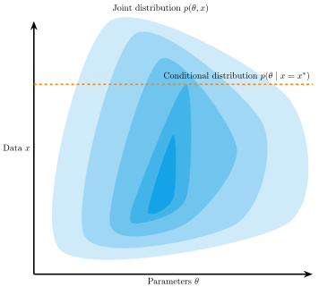

## 

> Artificial Intelligence has two goals. First, AI is directed toward getting computers to be smart and do smart things so that human beings don't have to do them. And second, AI *[...]* is also directed at using computers to simulate human beings, so that we can find out how humans work.

@simon1983should [p. 27], @van2024reclaiming


## Parameter estimation

What are the values of the model parameters $\theta$, given observed data $x$?

### Bayes' theorem

$$
\begin{aligned}
p(\theta \mid x) & = \frac{p(\theta, x)}{p(x)} \\
 & = \frac{p(\theta) \times p(x \mid \theta)}{\int p(\theta) \times p(x \mid \theta) d\theta}
\end{aligned}
$$

## Marginal likelihood
$$
p(x) = \int p(\theta) \times p(x \mid \theta) d\theta
$$ 

- difficult to evaluate
- often intractable

## Classic alternatives

- Approximate $p(\theta \mid x)$ 
  - Markov Chain Monte Carlo (MCMC): $p(\theta \mid x) \propto p(\theta) \times p(x \mid \theta)$
- Obtain point estimates:
  - Maximum likelihood: $\hat{\theta} = \operatorname*{argmax}_{\theta} p(x \mid \theta)$
  - Maximum aposteriori: $\hat{\theta} = \operatorname*{argmax}_{\theta} p(\theta) \times p(x \mid \theta)$

- None of the methods require $p(x)$
- But all require evaluating $p(x \mid \theta)$

## Simulation-based inference (SBI)

- "Likelihood-free"
- When we cannot even evaluate $p(x \mid \theta)$
- Approximate using simulations 

#### Examples

1. Surrogate Likelihood
2. Rejection Sampling
3. Approximate Bayesian Computation

Modern overview: @cranmer2020frontier

## Likelihood-Based vs. Simulation-Based Inference

{fig-align="center" height=70%}

## Surrogate likelihood

- For a given parameter value $\theta$, simulate many samples of $x$
- Estimate the density $p(x\mid\theta)$ (e.g., kernel density estimation)
  - Used for approximate MLE/MAP, or within MCMC

## Rejection sampling

$$
\begin{aligned}
p(\theta, x) & = p(\theta) p(x \mid \theta)\\
\end{aligned}
$$

{fig-align="center" height=70%}

## Rejection sampling

$$
\begin{aligned}
p(\theta, x) & = p(\theta) p(x \mid \theta)\\
\end{aligned}
$$

{fig-align="center" height=70%}

## Rejection sampling


$$
\begin{aligned}
\theta^{(s)} & \sim \text{Beta}(1, 1)\\
x^{(s)} &\sim \text{Binomial}(\theta^{(s)}, 10)\\
\\[0.1em]
\theta \mid x^{\text{obs}}=7 & \approx \text{Samples from } \theta^{(s)} \text{ where } x^{(s)} = 7
\end{aligned}
$$


```{.python filename="Python"}
prior = np.random.beta(1, 1, size=5000)
x = np.random.binomial(n=10, p=prior)

observed = 7
posterior = prior[x == observed] 
```

## Build your own rejection sampler

\Large
Time for exercise `rejection-sampling`

## Approximate Bayesian Computation (ABC)

- Generalization of rejection sampling
- Given a sampled parameter value $\theta$, generate a data set $x$
- Compare the simulated data set to observed $x^{\text{obs}}$
- Retain the parameter if the data sets are not too dissimilar

$$
\rho(s(x), s(x^{\text{obs}})) \leq \epsilon
$$


## Issues

- Computationally expensive
- Curse of dimensionality
- Handcrafted summary statistics


## Neural estimation

- Approximate using *generative neural networks*
  - Deep learning architecture that approximates a probability distribution 


::::{.columns}

:::{.column width=50%}
#### Neural likelihood estimation (NLE)

- Learn $p(x \mid \theta)$
- Surrogate likelihood
:::

:::{.column width=50%}
#### Neural posterior estimation (NPE)

- Learn $p(\theta \mid x)$
- Obtain posterior directly
:::
::::

## Amortized Bayesian Inference (ABI)

- Generative neural networks
  - Produce a distribution $q(\theta \mid x)$
- Train them on *simulated* pairs $(\theta^{(s)}, x^{(s)}) \sim p(\theta, x)$
  - Learn $q(\theta \mid x) \approx p(\theta \mid x)$
- Once trained, can be used on observed data $x^\text{obs}$
  - $q(\theta \mid x^\text{obs}) \approx p(\theta \mid x^\text{obs})$ 

## Amortized Bayesian Inference (ABI)

Pay the cost of inference upfront during training, receive benefits later

::::{.columns}

:::{.column width=50%}
### Training
- Train neural networks
- Simulated data and parameters
- Learn the mapping between data and parameters
- Slow, resource consuming process
:::

:::{.column width=50%}
### Inference
- Apply pretrained networks
- Observed data
- Posterior distribution of parameters
- Fast, cheap process
:::
::::

## Amortized Bayesian Inference (ABI)

Using deep learning generative neural networks to make Bayesian inference.

</br>

:::: {.columns}
:::{.column width=50%}
#### Advantages
- Fast inference
- Simulation based -- intractable models
:::


:::{.column width=50%}
#### Disatvantages
- Need for training
- Simulation based -- weaker guarantees
:::
::::


## References

