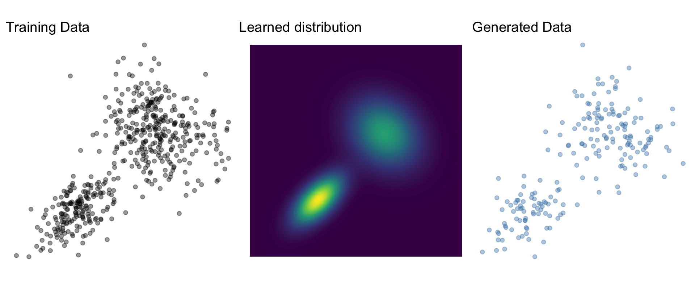
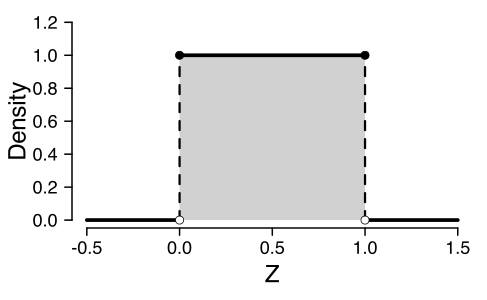
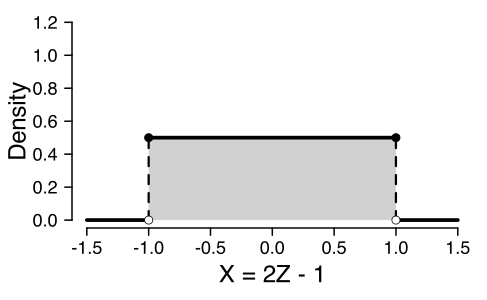
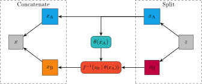
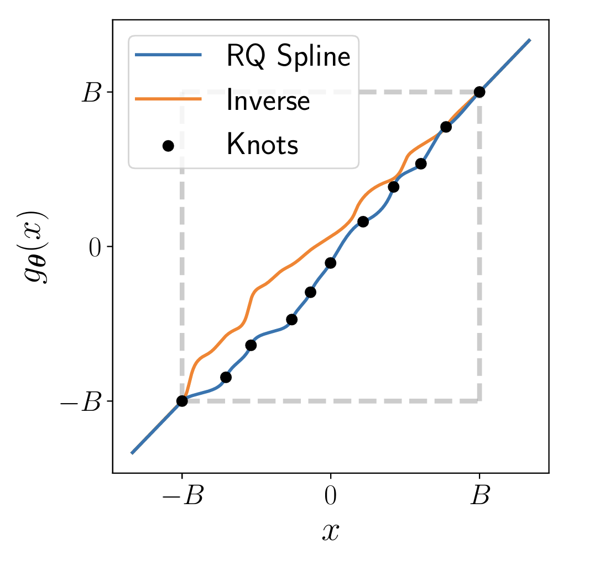

## Generative models

Learn $p_X$ given a set of training data $x_i, \dots, x_n$

{width=100%, fig-align="center"}

- Sampling $x \sim p_X$
- Density evaluation $p_X(x)$

## Mixture model

Weighted sum of multiple simpler distributions, e.g., Normal
$$p_X(X) = \sum_k^K w_k \times \text{Normal}(X; \mu_k, \sigma_k)$$

- Sampling and evaluating straightforward
- Theoretically can represent any distribution
- Practically, does not scale well

## Many architectures

- Markov random fields [@li2009markov]
- Generative adversarial networks [GAN, @goodfellow2014generative]
- Variational autoencoders [VAE, @kingma2013auto]
- **Normalizing flows** [@kobyzev2020normalizing;@papamakarios2021normalizing]
- Diffusion models [@song2020score]
- Flow matching [@lipman2022flow]
- Consistency models [@song2023consistency]

## Common idea

Map $p_X$ to a base distribution $p_Z$ through some operation $g$

$$
x \sim g(z) \text{ where } z \sim p_Z 
$$

](https://learnopencv.com/wp-content/uploads/2020/10/begin_gan.jpg){fig-align="center"}

# Normalizing flows

## Normalizing flows

Built on invertible transformations of random variables

- Find $f$ such that $f(X) = Z \sim \text{Normal}(0, I)$
  - $f$ *normalizes* $X$

::: {#fig-normalizing-flow layout="[[-10, 1, -10], [10, 1, 10]]"}

$f$

$$\rightarrow$$ 

Forward direction
:::

## Sampling

- Sample $z \sim p_Z$ (e.g., Normal)
- Obtain $x = f^{-1}(z)$

 

::: {#fig-normalizing-flow-rev layout="[[-10, 1, -10], [10, 1, 10]]"}

$f^{-1}$

$$\leftarrow$$ 

Backward direction
:::

## Density evaluation

Change of variables formula

$$
p_X(x) = p_Z(f(x)) \left| \det{J}_f(x) \right|
$$

- Express $p_X$ using $p_Z$ and the transform $f$
- $\left| \det{J}_f(x) \right|$: Absolute value of the determinant of the Jacobian matrix
  - "Jacobian" for short 
  - Volume correction term

## Change of variables - intuition

:::: {.columns}

::: {.column width="50%"}
$$Z \sim \text{Uniform}(0, 1)$$
:::

::: {.column width="50%"}

:::

::::

## Change of variables - intuition

:::: {.columns}

::: {.column width="50%"}
$$Z \sim \text{Uniform}(0, 1)$$

:::

::: {.column width="50%"}

:::

::::

## Change of variables - intuition

:::: {.columns}

::: {.column width="50%"}
$$Z \sim \text{Uniform}(0, 1)$$

:::

::: {.column width="50%"}
$$X = 2Z - 1$$
:::
::::

## Change of variables - intuition

:::: {.columns}

::: {.column width="50%"}
$$Z \sim \text{Uniform}(0, 1)$$

:::

::: {.column width="50%"}
$$X = 2Z - 1$$

:::
::::

## Change of variables - affine transform

$$f: Z = a X + b$$

- shift by $b$: no effect
- scale by a constant $a$: multiply by $a$

$$p_X(x) = p_Z(f(x)) \times a$$

## Change of variables - affine transform

 

#### Example

:::: {.columns}
::: {.column width="50%"}

\scriptsize
$$
\begin{aligned}
p_Z(z) & = \frac{1}{\sqrt{2\pi}} \exp\left(-\frac{1}{2} z^2 \right) \\[10pt]
f: Z & = \frac{(X - \mu)}{\sigma} \\
\end{aligned}
$$
:::

::: {.column width="50%"}

\scriptsize
$$
\begin{aligned}
p_X(x) & = p_Z(f(x)) \times a \\[10pt]
 & = \frac{1}{\sqrt{2\pi}} \exp\left(-\frac{1}{2} f(x)^2 \right) \times a \\[10pt]
 & = \frac{1}{\sigma\sqrt{2\pi}} \exp\left(-\frac{1}{2} \left(\frac{x-\mu}{\sigma}\right)^2 \right)
\end{aligned}
$$
:::
::::

## Change of variables - more formally

$$
p_X(x) = p_Z(f(x))  \left| \frac{d}{dx} f(x) \right|
$$

## Change of variables - more formally

$$
p_X(x) = p_Z(f(x))  \left| \frac{d}{dx} f(x) \right|
$$

#### Example

::::{.columns}

:::{.column width="50%"}

\scriptsize
$$
\begin{aligned}
f: Z & = \log(X) \\[10pt]
p_Z(z) & = \frac{1}{\sqrt{2\pi}} \exp\left(-\frac{1}{2} z^2 \right)
\end{aligned}
$$
:::

:::{.column width="50%"}

\scriptsize
$$
\begin{aligned}
\frac{d}{dx} f(x) & = \frac{d}{dx} \log(x) = \frac{1}{x} \\[10pt]
p_X(x) & = \frac{1}{x\sqrt{2\pi}} \exp\left(-\frac{1}{2} \log(x)^2\right)
\end{aligned}
$$
:::
::::

## Change of variables - multivariate

$$
p_X(x) = p_Z(f(x)) \left| \det{J}_f(x) \right|
$$

 

$$
J_f(x) = \begin{bmatrix}
\frac{\partial z_1}{\partial x_1} & \dots & \frac{\partial z_1}{\partial x_K} \\
\vdots & \ddots & \vdots \\
\frac{\partial z_K}{\partial x_1} & \dots & \frac{\partial z_K}{\partial x_K}
\end{bmatrix}
$$

## Change of variables - multivariate

$$f\left(\begin{bmatrix}x_1 \\ x_2\end{bmatrix}\right) = \begin{bmatrix} x_1^2 x_2 \\ 3x_1 + \sin x_2 \end{bmatrix} = \begin{bmatrix}z_1 \\ z_2\end{bmatrix}$$

 

$$J_f(x) = \begin{bmatrix}
\frac{\partial z_1}{\partial x_1} & \frac{\partial z_1}{\partial x_2} \\
\frac{\partial z_2}{\partial x_1} & \frac{\partial z_2}{\partial x_2}
\end{bmatrix} = \begin{bmatrix} 2x_1x_2 & x_1^2 \\ 3 & \cos x_2 \end{bmatrix}
$$

## Normalizing flow

$$
p_X(x) = p_Z(f(x)) \left| \det{J}_f(x) \right|
$$

Define a $f$ as a neural network with trainable weights $\phi$

 

### Training

Maximum likelihood (or rather: negative log likelihood)

$$
\arg \min_\phi - \sum_{i=1}^n \log p_Z(f(x_i \mid \phi)) + \log \left| \det{J}_f(x_i \mid \phi) \right|
$$

## Flow $f$

 

### Challenge

- Sampling: Invertible ($f^{-1}$)
- Training: 
  - Differentiable
  - Computationally efficient Jacobian
- Expressive to represent non-trivial distributions

## Flow composition

Invertible and differentiable functions are "closed" under composition

$$
f = f_L \circ f_{L-1} \circ \dots \circ f_1
$$

::: {#fig-flow-composition layout="[[-10, 1, -10, 1, -10, 1, -10], [10, 1, 10, 1, 10, 1, 10]]"}

$f_1$ 

$f_2$ 

$f_3$ 

$\rightarrow$ 

$\rightarrow$

$\rightarrow$

Flow composition in forward direction
:::

## Flow composition - inverse

To invert a flow composition, we invert individual flows and run them in the opposite order

$$
f^{-1} = f_1^{-1} \circ f_2 ^{-1} \circ \dots \circ f_L^{-1}
$$

::: {#fig-flow-composition layout="[[-10, 1, -10, 1, -10, 1, -10], [10, 1, 10, 1, 10, 1, 10]]"}

$f_1^{-1}$ 

$f_2^{-1}$ 

$f_3^{-1}$ 

$\leftarrow$ 

$\leftarrow$

$\leftarrow$

Flow composition in backward (inverse) direction
:::

## Flow composition - Jacobian

- Chain rule
$$
\left| \det{J}_f(x) \right| = \left| \det \prod_{l=1}^L J_{f_l}(x)\right| = \prod_{l=1}^L \left| \det{J}_{f_l}(x)\right|
$$

- if we have a Jacobian for each individual transformation, then we have a Jacobian for their composition
$$
\arg \min_\phi \sum_{i=1}^n \log p_Z(f(x_i \mid \phi)) + \sum_{l=1}^L \log \left| \det{J}_{f_l}(x_i \mid \phi) \right|
$$

## Linear flow

$$
f(x) = Ax + b
$$

- inverse: $f^{-1}(z) = A^{-1}(x - b)$
- Jacobian: $\left| \det{J}_f(x) \right| = \left| \det{A} \right|$

- Limitations:
  1. Not expressive (composition of linear functions is a linear function)
  2. Jacobian/inverse may be in $\mathcal{O}(p^3)$

## Coupling flows

- *Increasing* expresiveness while potentially *decreasing* computational costs
- A *coupling flow* is a way to construct non-linear flows

1. Split the data in two disjoint subsets: $x = (x_A, x_B)$
2. Compute parameters conditionally on one subset: $\theta(x_A)$
3. Apply transformation to the other subset: $z_B = f(x_B \mid \theta(x_A))$
4. Concatenate $z = (x_A, z_B)$

## Coupling flow: Forward

 

{fig-align="center"}

## Coupling flow: Inverse

 

{fig-align="center"}

## Coupling flow trick

- Jacobian

$$ J_f = 
\begin{bmatrix}
\text{I} & 0 \\
\frac{\partial}{\partial x_A}f(x_B \mid \theta(x_A)) & J_f(x_B \mid \theta(x_A))
\end{bmatrix}
$$

- Determinant

$$
\det{J}_f = \det(\text{I}) \times \det{J}_f(x_B \mid \theta(x_A)) = \det{J}_f(x_B \mid \theta(x_A))
$$

## Coupling flow trick

- $f(x_B\mid\theta(x_A))$ needs to be
  - differentiable
  - invertible
  - easy determinant of the Jacobian
- $\theta(x_A)$ can be arbitrarily complex
  - non-linear
  - non-invertible
  - $\rightarrow$ neural network

 

- Stack multiple coupling blocks and permute $x_{A}$ and $x_{B}$

## Affine coupling [@dinh2016density]

- $\theta(x_A)$: Trainable coupling networks, e.g., MLP
  - Output: Shift $\mu$ and scale $\sigma$ 
- Linear (affine) transform function $f(x_B\mid\theta(x_A)) = \frac{x_B - \mu(x_A)}{\sigma(x_A)}$

- Jacobian: $-\log{\sigma(x_A)}$

## Spline coupling [@muller2019neural]

::::{.columns}

:::{.column width=50%}
- Transformation: Splines
  - "Piecewise polynomials"
- More expressive
- Easier to overfit
- Slower at training and inference
:::

:::{.column width=50%}

:::

::::

## Build your own normalizing flow

\Large
Time for exercise `normalizing_flow`

## References